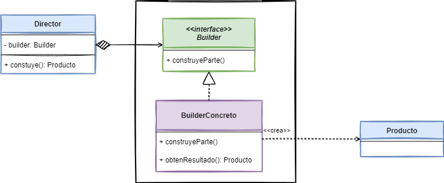

# Builder

## 👋 Bienvenid@s

Este repositorio contiene los ejemplos de código de la implementación del patrón de diseño [*Builder*](https://www.javatutoriales.com/2022/03/patron-de-diseno-builder.html).

Para ver el tutorial completo, con la explicación detallada del patrón, entra al Blog:
[JavaTutoriales](https://www.javatutoriales.com/2022/03/patron-de-diseno-builder.html)

En el tutorial doy una explicación y muestro la implementación del patrón.

Aquí dejo un breve (muy breve) resumen del mismo.

## 🎯 Objetivo de *Builder*

- Separar la construcción de un objeto complejo de su representación, de forma tal que con el mismo proceso se puedan crear diferentes representaciones.

## 📑 Diagrama

## ⚙️ Requerimientos
El proyecto está desarrollado usando **Java 17** y **Gradle 7.3**, no uso nada particular de esta versión de Java, por lo que es necesario que uses cualquier versión arriba de Java 5.

## 💻 Explicación
Para ver el tutorial completo, con la explicación detallada del patrón, entra al Blog:
[JavaTutoriales](https://www.javatutoriales.com/2022/03/patron-de-diseno-builder.html).